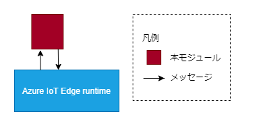
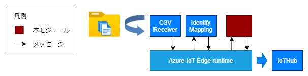

# TransportController

## 目次
* [概要](#概要)
* [機能](#機能)
* [Quick Start](#quick-start)
* [イメージのURL](#イメージのurl)
* [動作保証環境](#動作保証環境)
* [Deployment 設定値](#deployment-設定値)
  * [環境変数](#環境変数)
  * [Desired Properties](#desired-properties)
  * [Create Option](#create-option)
* [受信メッセージ](#受信メッセージ)
  * [Message Body](#message-body)
  * [Message Properties](#message-properties)
* [送信メッセージ](#送信メッセージ)
  * [Message Body](#SendMessageBody)
  * [Message Properties](#SendMessageProperties)
* [Direct Method](#direct-method)
* [ログ出力内容](#ログ出力内容)
* [ユースケース](#ユースケース)
  * [ケース ①](#Usecase1)
* [Feedback](#feedback)
* [LICENSE](#license)


## 概要
TransportControllerは、受信したメッセージをプロパティ毎にまとめ、規定経過時間または最大容量に達した時点でメッセージを送信するAzure IoT edgeモジュールです。

## 機能

入力されたメッセージの圧縮を行い、アウトプットに送信する。 <br>
また、メッセージバッファリングを用いた転送制御を行う。

バッファリングの仕組み（「transportcontrol」がtrueの場合のみ有効）

1. 「unitkey」で指定されたプロパティごとにメッセージをグループ化してバッファリングする
2. バッファされたメッセージのサイズが「sendsizemax」で指定されたサイズを超えた場合、<br>バッファされているメッセージを1つのメッセージとして送信する（「bandwidthcontrol」がfalseの場合のみ）
3. 「sendcycle」の時間が経過した場合、バッファされているメッセージを1つのメッセージとして送信する



## Quick Start
1. Personal Accese tokenを作成
（参考: [個人用アクセス トークンを管理する](https://docs.github.com/ja/authentication/keeping-your-account-and-data-secure/managing-your-personal-access-tokens)）

2. リポジトリをクローン
```
git clone https://github.com/Project-GAUDI/TransportController.git
```

3. ./src/nuget.configの<GITHUB_USERNAME>と<PERSONAL_ACCESS_TOKEN>を自身のユーザー名とPersonal Accese tokenに書き換えてください

4. Dockerイメージをビルド
```
docker image build -t <IMAGE_NAME> ./TransportController/src/
```
例）
```
docker image build -t ghcr.io/<YOUR_GITHUB_USERNAME>/transportcontroller:<VERSION> ./TransportController/src/
```

5. Dockerイメージをコンテナレジストリにプッシュ
```
docker push <IMAGE_NAME>
```
例）
```
docker push ghcr.io/<YOUR_GITHUB_USERNAME>/csvfilereceiver:<VERSION>
```

## イメージのURL
準備中
| URL                                                                 | Description         |
| ------------------------------------------------------------------- | ------------------- |

## 動作保証環境

| Module Version | IoTEdge | edgeAgent | edgeHub  | amd64 verified on | arm64v8 verified on | arm32v7 verified on |
| -------------- | ------- | --------- | -------- | ----------------- | ------------------- | ------------------- |
| 4.0.4          | 1.4.27  | 1.4.27    | 1.4.27   | ubuntu20.04       | －                  | －                  |


## Deployment 設定値

### 環境変数

#### 環境変数の値

| Key                 | Required | Default | Description                                                                               |
| ------------------- | -------- | ------- |----------------------------------------------------------------------------------------- |
| TransportProtocol   |          | Amqp    | ModuleClientの接続プロトコル。<br>["Amqp", "Mqtt"]                        |
| LogLevel            |          | info    | 出力ログレベル。<br>["trace", "debug", "info", "warn", "error"]           |
| DefaultReceiveTopic |          | IoTHub  | 受信時のトピック形式。 <br>["IoTHub", "Mqtt"]                            |
| DefaultSendTopic    |          | IoTHub  | 送信時のトピック形式。 <br>["IoTHub", "Mqtt"]                            |
| M2MqttFlag          |          | false   | 通信に利用するAPIの切り替えフラグ。<br>false ： IoTHubトピックのみ利用可能。<br>true ： IoTHubトピックとMqttトピックが利用可能。ただし、SasTokenの発行と設定が必要。 |
| SasToken            | △       |         | M2MqttFlag=true時必須。edgeHubと接続する際に必要なモジュール毎の署名。 |

### Desired Properties

#### Desired Properties の値

| JSON Key         | Type    | Required | Default | Description                                                                                                                                                                                      |
| ---------------- | ------- | -------- | ------- | ------------------------------------------------------------------------------------------------------------------------------------------------------------------------------------------------ |
| input            | string  |          | input   | メッセージのインプット名。                                                                                                                                                                         |
| output           | string  |          | output  | メッセージを送信するアウトプット名。                                                                                                                                                               |
| compress         | string  |          | none    | メッセージの圧縮形式。　「gzip」、「deflate」が選択可能<br>上記以外の場合は「none」扱いとなりメッセージは圧縮されない。                                                                              |
| transportcontrol | boolean | 〇       |         | 転送制御の有効可否「true」、「false」で設定。                                                                                                                                                      |
| bandwidthcontrol | boolean | △       |         | transportcontrol=true時必須。帯域制御機能の有効可否 「true」、「false」で設定。　                                                                                                 |
| sendsizemax      | number  | △       |         | transportcontrol=true時必須。メッセージのバッファリング最大サイズ（バイト）。　                                                                                                        |
| sendcycle        | number  | △       |         | transportcontrol=true時必須。メッセージの送信間隔（ミリ秒）。　                                                                                                                        |
| unitkey          | string  |          | null    | transportcontrol=true時有効。メッセージをバッファリングする際のグルーピングキー。<br>カンマ区切りで指定する。<br>指定しない場合はすべてのメッセージが1つのグループでバッファリングされる。 |

#### Desired Properties の記入例

```
{
  "input": "input",
  "output": "output",
  "compress": "gzip",
  "transportcontrol": true,
  "bandwidthcontrol": false,
  "sendsizemax": 3000,
  "sendcycle": 1000,
  "unitkey": "format,data_type,free_area,settingFileKey,productionMode"
}
```

### Create Option

#### Create Option の値

なし

#### Create Option の記入例

```
{}
```

## 受信メッセージ

### Message Body

任意

### Message Properties

任意

## 送信メッセージ

<a id="SendMessageBody"></a>

### Message Body

受信したメッセージのbodyを、Desired Propertiesのcompressに従ってEncodeして送信する

<a id="SendMessageProperties"></a>

### Message Properties

| Key               | Description                          |
| ----------------- | ------------------------------------ |
| iotedge_timestamp | 現在日時 ("yyyy-MM-dd HH:mm:ss.fff") |

## Direct Method

なし

## ログ出力内容

| LogLevel | 出力概要 |
| -------- | -------- |
| error    | [初期化/desired更新/desired取り込み/メッセージ受信]失敗<br>desired未設定(required値)<br>メッセージ保存失敗           |
| warn     | エッジランタイムとの接続リトライ失敗<br>環境変数の1部値不正     
| info     | 環境変数の値<br>desired更新通知<br>環境変数の値未設定のためDefault値適用<br>メッセージ[送信/受信]通知<br>メッセージをバッファに追加<br>レコードを切り捨て(bandwidthcontrol=true時)         |
| debug    | メッセージバッファをカウント     |
| trace    | メソッドの開始・終了<br>受信メッセージBody  |

## ユースケース

<a id="Usecase1"></a>

### ケース ①

不定期間隔でアップロードされるCSVのデータを圧縮してIoTHubに送信する



#### desiredProperties

```
{
  "input": "input",
  "output": "output",
  "compress": "gzip",
  "transportcontrol": true,
  "bandwidthcontrol": false,
  "sendsizemax": 3000,
  "sendcycle": 1000,
  "unitkey": "format,data_type,free_area,settingFileKey,productionMode"
}
```

#### 環境変数

| 名称     | 値    |
| -------- | ----- |
| LogLevel | debug |

#### 出力結果

CSVReceiverのメッセージを圧縮したメッセージ

出力例:圧縮したメッセージ

```
  {"MachineNumber":3,"SettingDateAndTime":"2020-08-05T13:52:02.0000000Z", ...},
  {"MachineNumber":3,"SettingDateAndTime":"2020-08-05T13:52:02.0000000Z", ...},
  {"MachineNumber":3,"SettingDateAndTime":"2020-08-05T13:52:02.0000000Z", ...},
  {"MachineNumber":3,"SettingDateAndTime":"2020-08-05T13:52:02.0000000Z", ...},
  {"MachineNumber":3,"SettingDateAndTime":"2020-08-05T13:52:02.0000000Z", ...},
  {"MachineNumber":3,"SettingDateAndTime":"2020-08-05T13:52:02.0000000Z", ...},
  {"MachineNumber":3,"SettingDateAndTime":"2020-08-05T13:52:02.0000000Z", ...},
  …
  {"MachineNumber":3,"SettingDateAndTime":"2020-08-05T13:52:02.0000000Z", ...},
  {"MachineNumber":3,"SettingDateAndTime":"2020-08-05T13:52:02.0000000Z", ...},
  {"MachineNumber":3,"SettingDateAndTime":"2020-08-05T13:52:02.0000000Z", ...},
  {"MachineNumber":3,"SettingDateAndTime":"2020-08-05T13:52:02.0000000Z", ...},
  {"MachineNumber":3,"SettingDateAndTime":"2020-08-05T13:52:02.0000000Z", ...}
```

## Feedback
お気づきの点があれば、ぜひIssueにてお知らせください。

## LICENSE
This project is licensed under the MIT License, see the [LICENSE](LICENSE) file for details.
